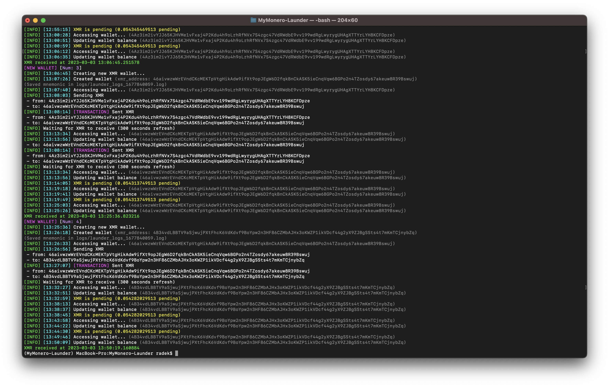
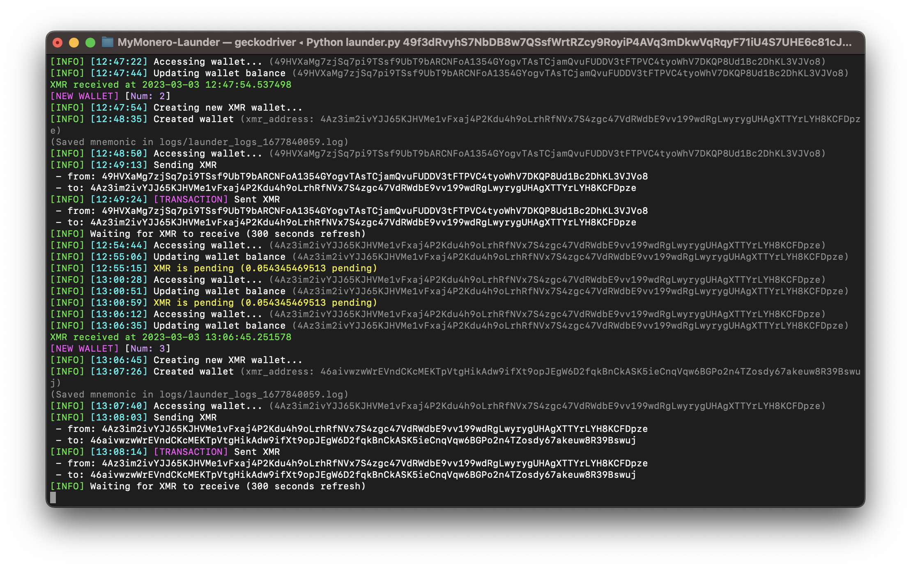
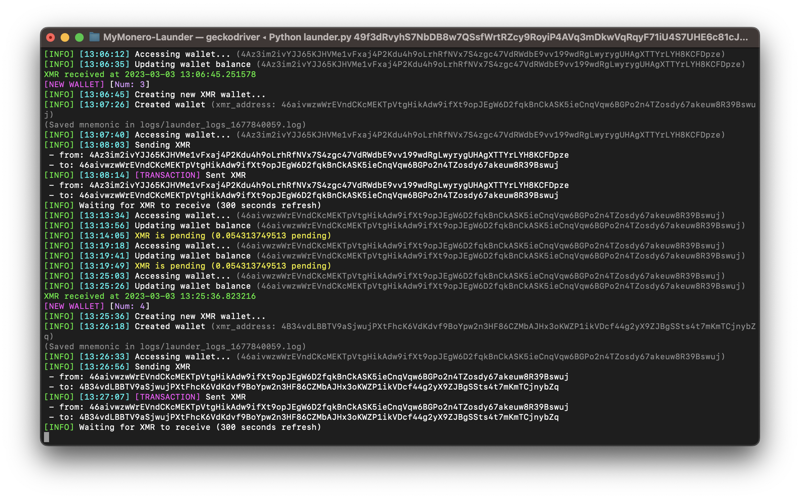

# MyMonero-Launder




## MyMonero-Launer (MyLaunder) is a tool based on Selenium and [MyMonero Wallet](https://wallet.mymonero.com/) to automatically generate multiple XMR wallets and exchange XMR between them and send it to the destination monero address.
### NOTE: <ins> Don't use it to any criminal abuses. </ins> It was created only for **educational** and **privacy** purposes.

<br>

MyLaunder is currently being improved.

<br>

## Installation

### Installing requirements
```
pip3 install -r requirements.txt
```

Firefox geckodriver needs to be installed.

<br>

### Usage

<p align='center'></p>

```
$ python3 launder.py -h

usage: MyMonero Launder [-h] [-delay DELAY] [--mnemonic] [--headless] destinationWallet walletAmount

Selenium bases python script to auto-generate new XMR wallets and transfer crypro between them

positional arguments:
  destinationWallet  The last wallet where XMR will be sent
  walletAmount       Amount of wallets to generate

optional arguments:
  -h, --help         show this help message and exit
  -delay DELAY       How often to refresh your wallet account balance? (Default 300 seconds)
  --mnemonic         Use existing XMR starting wallet
  --headless         Run selenium in headless mode


```

<br>

### Examples
```
python3 launder.py [XMR address] 6 --headless  # Run 6-depth XMR transferring in headless mode (without geckodriver windows popping)
```
```
python3 launder.py [XMR address] 2 --mnemonic  # Using mnemonic phrase

Input mnemonic phrase: ...
```

<br>

### Screenshots




<br>
Author: Radoslaw Rajda
